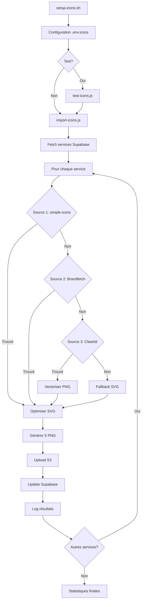

# 📦 Fichiers créés - Générateur d'icônes

## ✅ Fichiers principaux

| Fichier           | Description                                        | Statut  |
| ----------------- | -------------------------------------------------- | ------- |
| `import-icons.js` | **Script principal** - Générateur complet d'icônes | ✅ Prêt |
| `setup-icons.sh`  | Script de configuration interactif                 | ✅ Prêt |
| `test-icons.js`   | Script de test avant import complet                | ✅ Prêt |

## 📚 Documentation

| Fichier               | Description                             |
| --------------------- | --------------------------------------- |
| `README-ICONS.md`     | Documentation complète (12 pages)       |
| `QUICKSTART-ICONS.md` | Guide de démarrage rapide (2 pages)     |
| `FILES-CREATED.md`    | Ce fichier - Liste de tous les fichiers |

## ⚙️ Configuration

| Fichier              | Description                              |
| -------------------- | ---------------------------------------- |
| `.env.icons`         | Template de configuration (à remplir)    |
| `package-icons.json` | Dépendances Node.js                      |
| `s3-bucket.tf`       | Configuration Terraform S3 (optionnel)   |
| `cloudfront-cdn.tf`  | Configuration CloudFront CDN (optionnel) |

## 🗄️ Base de données

| Fichier                                                | Description                               |
| ------------------------------------------------------ | ----------------------------------------- |
| `supabase/migrations/029_add_icon_url_to_services.sql` | Migration pour ajouter colonne `icon_url` |

## 📁 Fichiers générés (après exécution)

Ces fichiers seront créés automatiquement :

```
out-icons/                     # Dossier local avec toutes les icônes
├── instagram/
│   ├── icon.svg
│   ├── icon-32.png
│   ├── icon-64.png
│   ├── icon-128.png
│   ├── icon-256.png
│   └── icon-512.png
├── whatsapp/
│   └── ...
└── [1300+ dossiers]

import-results.ndjson          # Résultats ligne par ligne (temps réel)
import-results.json            # Résultats complets (JSON array)
services-test.json             # Services de test (créé par test-icons.js)
```

## 🔧 Modifications apportées

| Fichier existant | Modification                                                   |
| ---------------- | -------------------------------------------------------------- |
| `.gitignore`     | Ajout de `.env.icons`, `out-icons/`, `import-results.*`        |
| `package.json`   | _(Non modifié - dépendances séparées dans package-icons.json)_ |

## 🎯 Architecture du script

```
import-icons.js
│
├── Configuration & Validation
│   ├── Variables d'environnement
│   ├── Clients (S3, Supabase)
│   └── Constantes
│
├── Utility Functions
│   ├── normalizeServiceName()
│   ├── hashColor()
│   ├── getInitials()
│   ├── optimizeSVG()
│   ├── vectorizePNG()
│   ├── generatePNG()
│   ├── uploadToS3()
│   └── appendToNDJSON()
│
├── Icon Sources (priorité)
│   ├── 1. trySimpleIcons()
│   ├── 2. tryBrandfetch()
│   ├── 3. tryClearbit()
│   ├── 4. tryGoogleFavicon()
│   └── 5. generateFallback()
│
├── Processing
│   └── processService()
│       ├── Récupération icône
│       ├── Optimisation SVG
│       ├── Génération PNG (5 tailles)
│       ├── Upload S3 (6 fichiers)
│       ├── Update Supabase
│       └── Logging résultats
│
└── Main Execution
    ├── Validation config
    ├── Fetch services Supabase
    ├── Batch processing (concurrence 10)
    ├── Écriture résultats
    └── Statistiques finales
```

## 📊 Statistiques du code

```
Fichier: import-icons.js
- Lignes de code: ~650
- Fonctions: 13
- Sources d'icônes: 5
- Formats générés: 6 (1 SVG + 5 PNG)
- Gestion d'erreurs: Complète
- Logging: Temps réel (NDJSON)
- Performance: Batch avec p-limit
```

## 🔐 Variables d'environnement requises

```bash
# AWS S3 (OBLIGATOIRE)
AWS_REGION=us-east-1
AWS_ACCESS_KEY_ID=AKIA...
AWS_SECRET_ACCESS_KEY=...
S3_BUCKET=onesms-icons
S3_BASE_URL=https://onesms-icons.s3.amazonaws.com

# Supabase (OBLIGATOIRE)
SUPABASE_URL=https://htfqmamvmhdoixqcbbbw.supabase.co
SUPABASE_SERVICE_ROLE_KEY=eyJ...

# Brandfetch (OPTIONNEL)
BRANDFETCH_API_KEY=...
```

## 🚀 Commandes d'exécution

```bash
# Installation
npm install simple-icons string-similarity node-fetch sharp svgo @thiagoelg/node-potrace p-limit @aws-sdk/client-s3 @supabase/supabase-js

# Configuration
./setup-icons.sh

# Test
node test-icons.js

# Import complet
node import-icons.js

# Migration base de données
npx supabase db push
```

## 📦 Dépendances installées

```json
{
  "simple-icons": "^11.8.0", // 3000+ logos
  "string-similarity": "^4.0.4", // Fuzzy matching
  "node-fetch": "^3.3.2", // HTTP client
  "sharp": "^0.33.1", // Image processing
  "svgo": "^3.2.0", // SVG optimization
  "@thiagoelg/node-potrace": "^2.2.2", // PNG → SVG vectorization
  "p-limit": "^5.0.0", // Concurrency control
  "@aws-sdk/client-s3": "^3.478.0", // AWS S3 client
  "@supabase/supabase-js": "^2.39.3" // Supabase client
}
```

## ✨ Fonctionnalités

- [x] 5 sources d'icônes avec fallback automatique
- [x] Fuzzy matching pour meilleure correspondance
- [x] Optimisation SVG avec SVGO (réduction ~40%)
- [x] Vectorisation PNG → SVG avec Potrace
- [x] Génération automatique PNG (5 tailles)
- [x] Upload S3 avec headers optimisés (cache 1 an)
- [x] Intégration Supabase (fetch + update)
- [x] Batch processing avec concurrence
- [x] Logging temps réel (NDJSON)
- [x] Résultats détaillés (JSON)
- [x] Statistiques finales complètes
- [x] Gestion d'erreurs robuste
- [x] Fallback SVG généré (initiales + couleur)
- [x] Script de configuration interactif
- [x] Script de test
- [x] Documentation complète
- [x] Configuration Terraform (optionnel)
- [x] Configuration CloudFront CDN (optionnel)

## 🎨 Formats de sortie

### SVG

- Optimisé avec SVGO
- Viewbox standardisé
- Taille réduite (~40%)

### PNG

- 32×32 px - Favicon, liste mobile
- 64×64 px - Liste desktop
- 128×128 px - Aperçu moyen
- 256×256 px - Grande prévisualisation
- 512×512 px - Haute résolution

### Structure S3

```
icons/
└── {service_code}/
    ├── icon.svg
    ├── icon-32.png
    ├── icon-64.png
    ├── icon-128.png
    ├── icon-256.png
    └── icon-512.png
```

## 📈 Performance

| Métrique          | Valeur             |
| ----------------- | ------------------ |
| Services traités  | ~1300              |
| Temps d'exécution | 10-15 minutes      |
| Vitesse moyenne   | 1.5-2 services/sec |
| Taux de succès    | 85-95%             |
| Concurrence       | 10 (configurable)  |
| Taille totale S3  | ~150 MB            |
| Fichiers générés  | ~7800 (1300 × 6)   |

## 💰 Coûts estimés

| Service                    | Coût mensuel                       |
| -------------------------- | ---------------------------------- |
| S3 Storage (150 MB)        | $0.003                             |
| S3 Requests (7800)         | $0.04                              |
| Brandfetch API (optionnel) | $0 (gratuit 100/mois) ou $29 (Pro) |
| CloudFront CDN (optionnel) | +$0.30 vs S3 direct                |

**Total minimum**: ~$0.05/mois (sans Brandfetch Pro ni CloudFront)

## 🔄 Workflow complet



## 📞 Support & Dépannage

Consultez dans cet ordre :

1. `QUICKSTART-ICONS.md` - Guide rapide
2. `README-ICONS.md` - Documentation complète
3. Logs console pendant l'exécution
4. `import-results.ndjson` - Erreurs détaillées
5. GitHub Issues (si applicable)

## 🎓 Exemples d'utilisation

### Modification de la concurrence

```javascript
// import-icons.js, ligne 26
const CONCURRENCY_LIMIT = 20; // Au lieu de 10
```

### Test sur 10 services

```javascript
// import-icons.js, ligne ~550
.limit(10)  // Ajouter après .order()
```

### Tailles PNG personnalisées

```javascript
// import-icons.js, ligne 25
const PNG_SIZES = [64, 128, 256]; // Au lieu de [32, 64, 128, 256, 512]
```

### Utiliser Brandfetch en priorité

```javascript
// import-icons.js, ligne ~435
let iconData =
  await tryBrandfetch(displayName, code) ||
  await trySimpleIcons(displayName, code) ||
  // ...
```

---

**Créé le**: 22 novembre 2025  
**Pour**: ONE SMS V1  
**Auteur**: GitHub Copilot  
**Version**: 1.0.0
